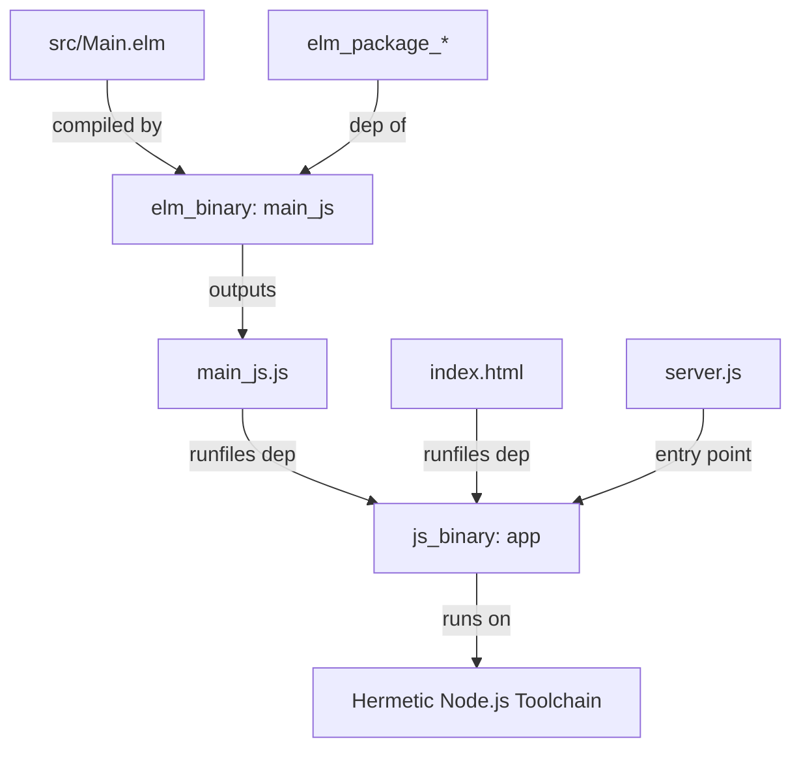

# Architecture: Hermetic Elm Build with Bazel (Bzlmod)

This document details the architecture and design decisions for the hermetic Elm "Hello, World!" application built with Bazel using Bzlmod.

## Overview

The goal is to provide a fully hermetic build and run environment for an Elm application. Running `bazelisk run :app` should compile the Elm code, package it with an HTML host, and serve it locally without relying on any pre-installed tools on the host system (like Node, Python, or Elm).

## Current Approach

The current architecture uses a hybrid approach leveraging language-specific Bazel rules and modern JavaScript rules:

### Components

1.  **Compiler & Dependencies (`rules_elm`):**
    *   Uses `kczulko/rules_elm` (v1.1.1) from the Bazel Central Registry (BCR).
    *   Downloads the official Elm compiler binary hermetically.
    *   Manages Elm package dependencies (e.g., `elm/core`, `elm/html`) by downloading them as archives and declaring them as local repositories using the `elm.repository` module extension tag.
    *   **Hermeticity Mechanism:** The ruleset wraps the Elm compiler and runs it with a simulated `ELM_HOME`. It generates a mock `versions.dat` (Elm's package index cache) containing only the declared dependencies. This prevents the Elm compiler from attempting to access the internet during compilation.

2.  **Runner (`aspect_rules_js`):**
    *   Uses `aspect_rules_js` (v2.9.2) to define the runnable target.
    *   Uses `js_binary` to execute a local `server.js` script.
    *   **Hermeticity Mechanism:** `aspect_rules_js` manages a hermetic Node.js toolchain. The `app` target runs on this hermetic Node.js runtime, ensuring it behaves identically regardless of the host system's state.

3.  **Static File Server (`server.js`):**
    *   A minimal, dependency-free Node.js script using only built-in modules (`http`, `fs`, `path`).
    *   Serves `index.html` and the compiled `main_js.js` from the Bazel runfiles directory.

## The Role of `elm.json`

In a standard Elm project, `elm.json` is the source of truth for dependencies and project configuration (similar to `package.json` in Node.js). However, in this Bazel setup, its role is split:

*   **During Bazel Compilation (Ignored):** The `rules_elm` build actions actually ignore the workspace `elm.json` for compilation. Instead, the ruleset dynamically generates a temporary `elm.json` file inside the sandbox. This generated file is populated solely with the dependencies declared in your `BUILD.bazel` target (`deps = [...]`). This enforces strict dependency tracking and prevents the compiler from seeing undeclared dependencies.
*   **For IDE and Tooling (Required):** The `elm.json` file in the root directory remains necessary for local developer experience. Editor integrations (such as the Elm Language Server) require a valid `elm.json` to resolve imports, provide autocomplete, and perform syntax checking. Without it, your IDE will display errors, even if the Bazel build succeeds.

---

## Alternatives Considered

### 1. Python-based Runner (`sh_binary` + `python3 -m http.server`)
*   **Description:** A shell script wrapper that launches Python's built-in HTTP server.
*   **Why Rejected:** Less hermetic. It relies on the host system's `python3` binary. If Python is missing or a different version is installed, the runner might fail.
*   **Pros:** Slightly simpler Bazel configuration (no direct `aspect_rules_js` dependency in `BUILD.bazel`).

### 2. Full NPM-Managed Pipeline (`rules_js` + `http-server` package)
*   **Description:** Using `rules_js` to install a standard web server (like `http-server`) from NPM, and using `js_run_devserver` to run it.
*   **Why Rejected:** Too much boilerplate for a basic "Hello, World!" project. It would require creating `package.json` and `pnpm-lock.yaml` just to fetch a web server.
*   **Pros:** Uses industry-standard tools (like `http-server` or `vite`) which are more robust for larger projects.
*   **Status:** Recommended transition path if this project grows beyond a simple prototype.

---

## Strengths

*   **True Hermeticity:** Zero dependence on host-installed Node.js, Python, or Elm. The build and run environments are fully reproducible.
*   **No NPM Boilerplate:** Does not require `package.json` or `pnpm-lock.yaml` for the user project, keeping the Elm focus clear.
*   **Fast & Incremental:** Bazel caches the Elm compilation and only rebuilds when Elm sources or dependencies change.

## Weaknesses & Tradeoffs

*   **Manual Dependency Management:** Adding a new Elm dependency (e.g., `elm/http`) requires manually finding its URL and SHA-256 hash, and declaring it in `MODULE.bazel`. There is no automatic `elm install` equivalent.
*   **Minimal Server:** `server.js` is extremely basic. It lacks robust security features, routing, or middleware.

---

## GOTCHAs & Limitations

*   **Duplicate Repository Error:**
    *   *Issue:* Calling `elm.toolchain()` in the root `MODULE.bazel` causes a duplicate repository error (`com_github_rtfeldman_node_test_runner` already generated).
    *   *Resolution:* Do not call `elm.toolchain()` in the root module. `rules_elm` automatically registers the default Elm toolchain.
*   **Path Resolution in Runfiles:**
    *   Bazel executes binary targets within a symlinked runfiles directory.
    *   `server.js` must resolve paths relative to `__dirname` to successfully locate `index.html` and `main_js.js`.
*   **Elm Version Constraint:**
    *   `rules_elm` (v1.1.1) is hardcoded to Elm `0.19.1`. Upgrading Elm would require upgrading the ruleset or overriding the compiler toolchain manually.
